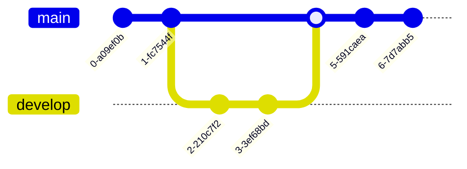

# I³ AnonyMate
## **InnerSource library for text anonymization**

**REMARK:** 
The application formerly known as Text Anonymizer is currently being rebranded.
* The new name for the Python library is I³ AnonyMate
* The new name for the managed service is [RX AnonyMate](https://git.i.mercedes-benz.com/i3/rx-anonymate)
    * Subscripe via [OneAPI](https://developer.corpinter.net/apis/text_anonymization_service?preselectedVersion=v0&preselectedEnvironment=production)

<br>


<br>

Taking care of [PII (Personal Identifiable Information) or Personal Data (PD)](https://en.wikipedia.org/wiki/Personal_data) is an essential part of any data driven project. At the latest since the [GDPR/DSGVO](https://en.wikipedia.org/wiki/General_Data_Protection_Regulation), this applies to every process at Mercedes-Benz.

This library covers the most common languages and PIIs used in documents across Mercedes-Benz. It helps to find and anonymize those PIIs easily. This is an important step towards GDPR compliance. However be informed that the use of this library does not free you from your responsiblity to comply with the GDPR or other regulations from inside and outside your company.


<br>

---

## **Table of contents**
- [On which environment can I use I³ AnonyMate?](#on-which-environment-can-i-use-i-anonymate)
- [Looking for a service / REST API?](#looking-for-a-service--rest-api)
- [Old releases documentation](#old-releases-documentation)
- [Coverage](#coverage)
  - [Available Languages](#available-languages)
  - [Available PIIs And Regions](#available-piis-and-regions)
- [Anonymization Techniques](#anonymization-techniques)
- [Getting Started](#getting-started)
  - [Requirements](#requirements)
  - [Setup Option 1: Virtual Environment and wheel file](#setup-option-1-virtual-environment-and-wheel-file)
  - [Setup Option 2: Poetry](#setup-option-2-poetry)
- [How to ..](#how-to)
  - [.. anonymize a text.](#anonymize-a-text)
  - [.. classify a text and list entities.](#classify-a-text-and-list-entities)
  - [.. print available entities, languages, regions and anonymization techniques.](#print-available-entities-languages-regions-and-anonymization-techniques)
  - [.. restrict analysis to specific languages, entities, and regions.](#restrict-analysis-to-specific-languages-entities-and-regions)
  - [.. change the anonymization technique.](#change-the-anonymization-technique)
  - [.. use language detection](#use-language-detection)
- [Evaluation](#evaluation)
- [Methods](#methods)
- [Contributing](#contributing)
  - [Technical Introduction To This Library](#technical-introduction-to-this-library)
  - [How To Implement Recognizers For This Library](#how-to-implement-recognizers-for-this-library)
  - [How To Share Your Contributions](#how-to-share-your-contributions)
  - [Development guideline and branching-concept](#development-guideline-and-branching-concept)
- [License](#license)
- [Contact](#contact)

<br>

---

## **On which environment can I use I³ AnonyMate?**

As I³ AnonyMate is Python library, you can use it in any Phython environment or also in Databricks (either on-prem or off-prem). Therefore I³ / RX solutions are no longer limited to Kubernetes environments.

<br>

---

## **Looking for a service / REST API ?**
With our RX AnonyMate service you can add anonymization to your application without the need to set up the AnonyMate library on your side. If you are interested visit us on [oneAPI](https://developer.corpinter.net/apis/text_anonymization_service?preselectedVersion=v0&preselectedEnvironment=production) to subscribe or see [rx-anonymate](https://git.i.mercedes-benz.com/i3/rx-anonymate) for more infos and to raise issues.

<br>

---

## **Old releases documentation**
By default, you're viewing the **master** branch documentation which aligns with the [latest release](https://git.i.mercedes-benz.com/i3/i3-anonymate/releases/latest). If you need to see an older version, have a look at the [old release docs](docs/old_releases_docs.md)

<br>

---
## Coverage

### **Available Languages**
The following table shows the languages currently covered. Languages are specified by [ISO_639-1](https://en.wikipedia.org/wiki/ISO_639-1) language codes.
| |**Name**|**Language Code**|
|:---:|:---|:---:|
|1|German|de|
|2|English|en|
|3|Spanish|es|

If you would like to process texts in another language, that is currently not supported, we recommend to try the following approach. Specify English as the language of the text and restrict your analysis to PIIs that are "VALID_GLOBALLY", except for PERSON (see table below). Depending on your use case you might want to add more PIIs, for example to identify German addresses in a French text. As a remedee for that we recommend to add other PIIs, while simultaneously restricting the region to take into account. However, adding region-specific recognizers can lead to decreased performance.

<br>

### **Available PIIs And Regions**
The following table shows the PIIs and regions currently covered. Regions are specified by [ISO 3166-1 alpha-2](https://en.wikipedia.org/wiki/ISO_3166-1_alpha-2) country codes. If a PII is valid globally its region is set to VALID_GLOBALLY.
| |**Name**|**Label**|**Available Regions**|**Description**|**Examples**| 
|:-----:|:-----|:-----|:-----|:-----|:-----|
|1|person|PERSON|VALID\_GLOBALLY|name of a person|Max Mustermann|
|2|email |EMAIL\_ADDRESS|VALID\_GLOBALLY|email address|max.mustermann<area>@mercedes-benz.com|
|3|address |ADDRESS|AT, CH, DE, ES, GB, US|address (must contain: house number, street, post code or city)|Musterstraße 2 - 70771 - Karlsruhe|
|4|phone number|PHONE\_NUMBER|AT, CH, DE, ES, GB, US|phone number (landline, mobile, fax etc.)|0176 12345678; +49 176 12345678|
|5|VIN|VIN|VALID\_GLOBALLY|vehicle identification number|WDD2121234A123456|
|6|license plate|LICENSE\_PLATE|AT, CH, DE, ES, GB|license plate|OY-54-BCV|
|7|credit card number|CREDIT\_CARD|VALID\_GLOBALLY|credit card number|374245455400126|
|8|IBAN code|IBAN\_CODE|VALID\_GLOBALLY|IBAN code|DE12500105170648489890|
|9|IP address|IP\_ADDRESS|VALID\_GLOBALLY|IP address (IPv4 or IPv6)|192.0.2.42|
|10|MAC address|MAC\_ADDRESS|VALID\_GLOBALLY|MAC address|E4-B9-7A-DE-00-94|
|11|International Mobile Equipment Identity|IMEI|VALID\_GLOBALLY|International Mobile Equipment Identity|013200003915965|
|12|driver license number|DRIVER_LICENSE|AT, CH, DE, GB, US|driver license number|B072RRE2I55|  
|13|passport number|PASSPORT|AT, CH, DE, ES, US|passport number|T22000129|
|14|identity card number|IDENTITY_CARD|CH, DE, ES, US|identity card number|S2100025|

<br>

---

## Anonymization Techniques

The following table shows the anonymization techniques currently available.
| |**Name**|**Description**|
|:---:|:---|:---|
|1|replace|Replaces the PII with its label.|
|2|redact|Removes the PII without replacement.|

<br>

---

## Getting Started

### **Requirements**
Supported python versions: 3.10, 3.11

Tested OS: Windows, Linux, Mac

<br>

### **Setup Option 1: Virtual Environment and wheel file**
**Virtual Environment**

Set up a virtual environemnt for your python package. This could be done, e.g., using Python's [venv](https://docs.python.org/3/library/venv.html), [Miniconda](https://docs.anaconda.com/miniconda/miniconda-install/) or the more commercial-use friendly version [miniforge](https://github.com/conda-forge/miniforge). With conda this would be done the following way:

```bash
conda create -n anonymate python==3.11
```

```bash
conda activate anonymate 
```

**Install Wheel File**

Go to [releases](https://git.i.mercedes-benz.com/i3/i3-anonymate/releases), find the release version you want to use, e.g. [latest](https://git.i.mercedes-benz.com/i3/i3-anonymate/releases/latest), and download the wheel file attached to the release and install it in your created and activated environment.

```bash
python -m pip install <path-to-wheel>
```

<br>

### **Setup Option 2: Poetry**
We use [poetry](https://python-poetry.org/docs/) to manage dependencies and to build the python package. You can use it as well to create a poetry environment and install the package via this repository. Follow [poetry's installation guide](https://python-poetry.org/docs/#installation), make sure you are using the poetry version stated at the beginning of the poetry.lock file in this repository, and make sure that you are using a supported python version, as stated under [requirements](#requirements), for example using [pyenv](https://github.com/pyenv/pyenv). As soon as you setup poetry, you can run following command in the root directory of your cloned repository which contains a pyproject.toml and the poetry.lock file:

```bash
poetry install
```


<br>

---

## How to ..

### **.. anonymize a text.**

```python
from text_anonymizer import TextAnonymizer

text_anonymizer = TextAnonymizer()

# Anonymize a German text.
text = "Hallo mein Name ist Michael Schuhmacher."
result = text_anonymizer.process(text=text, language='de')
print(result['text'])

# Anonymize an English text.
text = "Hello my name is Michael Jackson."
result = text_anonymizer.process(text=text, language='en')
print(result['text'])
```

OUTPUT

```
Hallo mein Name ist <PERSON>.
Hello my name is <PERSON>.
```

This is the simplest way to use our library. However we **recommend to use the 'regions' argument** of the process method and specify the regions the PIIs can come from. This will disable recognizers that cover PIIs from other regions and therefor effectively reduce the number of False Positives. So, let's say you know your text is likely to contain PIIs from GB only, then use this information to narrow down the possibilities and increase the quality of your anonymization. If you do not have that kind of information, do not worry, the performance will still be good. More information about how to restrict your analysis can be found in the [restrict analysis to specific languages entities and regions](#-restrict-analysis-to-specific-languages-entities-and-regions) section.

<br>

### **.. classify a text and list entities.**

```python
from text_anonymizer import TextAnonymizer

text_anonymizer = TextAnonymizer()

# Process a text with activated 'detect' flag to add a list of found entities to the result.
text = "Please contact customer for support. WDD2121234A123456, phone +49 176 12345678. Regards, Bill :)"
result = text_anonymizer.process(text=text, language='en', detect=True)

# Classify text.
if result['entities']:
    print('Caution: This text contains personal data!')
else:
    print('This text does not contain personal data.')

# Iterate over entities.
for entity in result['entities']:
    entity_text_string = text[entity['start']:entity['end']]
    print(f'"{entity_text_string}" is a {entity['type']} found at '
          f'position {entity['start']}-{entity['end']}.')
```

OUTPUT

```
Caution: This text contains personal data!
"WDD2121234A123456" is a VIN found at position 37-54.
"+49 176 12345678" is a PHONE_NUMBER found at position 62-78.
"Bill" is a PERSON found at position 89-93.
```

<br>

### **.. print available entities, languages, regions and anonymization techniques.**

When constructing a TextAnonymizer instance, you can specify any subset of the printed values as the supported languages, entities and regions, and when calling the process method of your TextAnonymizer instance, you can specify one of the available anonymization techniques.

```python
from text_anonymizer import text_anonymizer_info

text_anonymizer_info()
```

OUTPUT

```
Info:
    available languages: ['de', 'en', 'es']
    available entities: ['ADDRESS', 'CREDIT_CARD', 'DRIVER_LICENSE', 'EMAIL_ADDRESS', 'IBAN_CODE', 'IDENTITY_CARD', 'IMEI', 'IP_ADDRESS', 'LICENSE_PLATE', 'MAC_ADDRESS', 'PASSPORT', 'PERSON', 'PHONE_NUMBER', 'VIN']
    available regions: ['AT', 'CH', 'DE', 'ES', 'GB', 'US']
    available techniques: ['redact', 'replace']
```

<br>

### **.. restrict analysis to specific languages, entities, and regions.**

```python
from text_anonymizer import TextAnonymizer

# Set the languages, entities and regions the text anonymizer is intented to be used for.
# This can be any subset of the available values listed by the text_anonymizer_info function.
# If set to None, no restriction takes place and all available values are considered.
supported_languages = ['en']
supported_entities = ['PHONE_NUMBER', 'PERSON']
supported_regions = None

text_anonymizer = TextAnonymizer(supported_languages=supported_languages,
                                 supported_entities=supported_entities,
                                 supported_regions=supported_regions)

example_text = "Please contact customer for support. WDD2121234A123456, phone +49 176 12345678. Regards, Bill :)"

# Scenario I: Anonymize text without further restriction, hence consider all supported values
result = text_anonymizer.process(text=example_text, language='en')

# VIN, will not be anonymized, since it was not specified when constructing the TextAnonymizer instance.
# Phone number and person will be anonymized, since PHONE_NUMBER was specified when constructing the TextAnonymizer instance.
print(result['text'])


# Scenario II: Anonymize text with further restrictions, passed to process method
# To further restrict processing choose any subset of the specified values during inizialization of the TextAnonymizer instance above.
result = text_anonymizer.process(text=example_text, language='en', entities=['PHONE_NUMBER'], regions=['GB'])

# VIN and PERSON will not be anonymized since they are not in the list of entities given to process.
# Phone number will not be anonymized because it is a German phone number and DE is not given as region.
print(result['text'])
```

OUTPUT

```
Please contact customer for support. WDD2121234A123456, phone <PHONE_NUMBER>. Regards, <PERSON> :)
Please contact customer for support. WDD2121234A123456, phone +49 176 12345678. Regards, Bill :)
```

<br>

### **.. change the anonymization technique.**

```python
from text_anonymizer import TextAnonymizer

# Set an anonymization technique listed by the text_anonymizer_info function.
technique_redact = 'redact'
technique_replace = 'replace'

text_anonymizer = TextAnonymizer()

example_text = "Hallo mein Name ist Michael Schuhmacher."

result = text_anonymizer.process(text=example_text, language='de', technique=technique_redact)
print(result['text'])

result = text_anonymizer.process(text=exampletext, language='de', technique=technique_replace)
print(result['text'])
```

OUTPUT

```
Hallo mein Name ist .
Hallo mein Name ist <PERSON>.
```

<br>

### **.. use language detection**
If you work with texts in different languages that you have not categorized accordingly, you might want to use the `detect_language` parameter. It allows to detect supported languages and raises an error if no supported language could be detected. This means, if you know the language you should select it and only use this feature when in doubt. The shorter the texts, the more error prone the detection. So if your texts are only a few words it might run more often into errors when detecting the language due to low confidence of the detection result.
```python
from text_anonymizer import TextAnonymizer

text_anonymizer = TextAnonymizer()

# Anonymize a German text.
text = "Hallo mein Name ist Michael Schuhmacher."
result = text_anonymizer.process(text=text, detect_language=True)
print(result['text'])

# Anonymize an English text.
text = "Hello my name is Michael Jordan and I live on 5th Avenue New York."
result = text_anonymizer.process(text=text, detect_language=True)
print(result['text'])
```

OUTPUT

```
Hallo mein Name ist <PERSON>.
Hello my name is <PERSON> and I live on <ADDRESS>.
```

<br>

---

## Evaluation

We set up an evaluation framework to measure the performance of the anonymization on a token-level. The used datasets are labeled manually and are chosen to capture a broad variety of forms a PII can take. The whole of all used evaluation datasets cover all PIIS, regions and languages offered by the library, real Mercedes-Benz XSF tickets, and real Mercedes-Benz legal documents. While easily recognizable PIIs like email-addresses can be detected with an F-score of 1 on our evaluation data, more difficult PIIs like Person still reach an F-score of >=0.93 in German or English speaking regions in our evaluation.

For more details, see the more elaborate [Evaluation results](/docs/evaluation_results.md) with a more thorough description of our evaluation method.


<br>

---

## Methods

The following table shows the most important methods used to identify PIIs.
| |**Name**|**Description**|
|:---:|:---|:---|
|1|regex|[regular expressions](https://en.wikipedia.org/wiki/Regular_expression)|
|2|common NLP techniques|tokenization, stop words, blacklists|
|3|named entity recognition (NER)|NER by pre-trained language models from [spaCy](https://spacy.io/) and [huggingface](https://huggingface.co/)|

<br>

---

## Contributing

We strive to make this library the de-facto standard for text-anonymization at Mercedes-Benz and we highly welcome anyone who wants to join our community of developers :heart:

<br>

### **Technical Introduction To This Library**
This library is based upon [Presidio´s libraries for text-anonymization](https://microsoft.github.io/presidio/). It uses Presidio´s anonymization pipeline as its core and adds on top of it an easy-to-use interface with an out-of-the-box experience, regional support and many recognizers that are not available in Presidio or perform better than existing Presidio recognizers. Since Presidio is the base for our implementation, you should make yourself familiar with it.

<br>

### **How To Implement Recognizers For This Library**
Most recognizers of this library are child classes of one of [Presidio´s recognizer base classes](https://microsoft.github.io/presidio/analyzer/adding_recognizers/) and our [CustomRecognizerMixin](src/text_anonymizer/custom_recognizer_base.py) class. Detailed instructions are documented inside the [CustomRecognizerMixin](src/text_anonymizer/custom_recognizer_base.py) class and [here](src/text_anonymizer/recognizers/mb_user_id.py). Additionally, some of our pattern recognizers are derived from our [CustomPatternRecognizer](src/text_anonymizer/custom_recognizer_base.py) class only. This base class is an extended version of Presidio´s PatternRecognizer class equiped with usefull extras, derived from Presidio´s PatternRecognizer class and our CustomRecognizerMixin class.

<br>

### **How To Share Your Contributions**
If you want to contribute to our project, please read [this document](/CONTRIBUTING.md).

For further questions or discussions please reach out to us via email. Our documentation is only at the beginning and we are happy to incorporate any feedback from you :smiley:

Thanks, your AnonyMate team!

<br>
---

## Development guideline and branching-concept

**Branching Concept**

Below is the branching concept illustrated:



### Guidelines

**Branch Creation**
- Always checkout the respective branch (e.g., `master` or `develop`) with the latest data.
- From there, create a feature branch. Naming conventions:
  - For features: `feature/TaskID`.
  - For tech debt: `techdebt/TaskID`.
  - For hotfixes: `hotfix/TaskID`.

**Merging**
- Merging back from a feature branch to the `master` or `develop` branch (from where it was branched) must:
  - Be done via a **pull request (PR)**.
  - Be **approved by a reviewer** before merging.

**Commit Messages**
- Commit messages should include details about the changes or modifications made to the code.
  - **Do:** `Fix null pointer issue in user login module`
  - **Do Not:** `Testing this` or `New feature` without context.
- Avoid using arbitrary or unclear text in commit messages.

---

## License
For copyright and license information regarding this repository see [License](/LICENSE.md) and [Notice](/NOTICE). 
We make use of Free and Open Source Software whose licenses are documented in [3rd Party Licenses](/LICENSE-3RD-PARTY.txt).

<br>

---

## Contact
Please contact us via email at **anonymate@mercedes-benz.com**.
