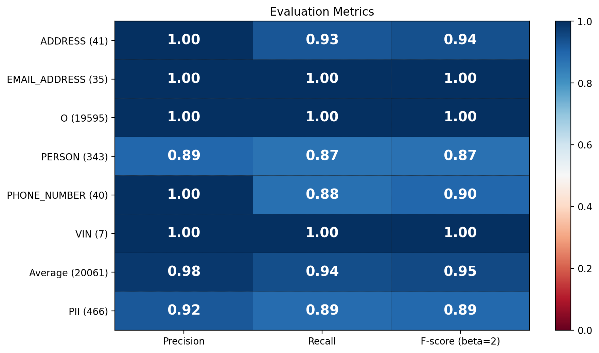

## Evaluation

We set up an evaluation framework to measure the performance of the anonymization on a token-level. Our evaluation framework is a customized fork of [Presido´s research framework](https://github.com/microsoft/presidio-research). Each time we change a PII recognizer we run this evaluation framework on our data sets and measure Precision, Recall and F2-score for each PII. F2-score is a special case of a [F-score](https://en.wikipedia.org/wiki/F-score), where recall is weighted higher than precision. This is a common choice for anonymization use cases, where it is more important to find all PIIs than it is to avoid false positives. The data sets are labeled manually and are chosen to capture a broad variety of forms a PII can take. For labeling we use [label-studio](https://github.com/heartexlabs/label-studio).

The following table shows the data sets we use for evaluation:

| |**Data Set**|**Description**|
|:---:|:---|:---|
|1|core sets|manually designed data sets that cover all PIIs, regions and languages|
|2|xsf|real data set from Mercedes-Benz containing XSF tickets|
|3|legal|real data set from Mercedes-Benz containing legal documents|

The following graphics show the results for our regional evaluations. For regional evaluations we choose data sets that contain PIIs from a single region only and limit the processing pipeline to PII recognizers that cover these regions only. This is in line with our usage recommendation described [here](../README.md#-anonymize-a-text). Person and address are the most challenging PIIs for our library and more standardized PIIs are generally more easily to recognize. Please keep in mind that data quality is crucial for anonymization performance. Performance on messy data can drop significantly and performance on a new data set might vary to a high degree.

regional evaluation for XSF data from Austria (region AT):

regional evaluation for XSF data from Switzerland (region CH):

regional evaluation for XSF data from Germany (region DE):

regional evaluation for XSF data from Spain (region ES):

regional evaluation for XSF data from United Kingdom (region GB):

regional evaluation for XSF data from USA (region US):

Note: The label 'O' is assigned to any token that is not a PII. The label 'PII' is assigned to any token that is any kind of PII. We strive to achieve performances above 90 %. However, keep in mind that recall is much more important than precision for anonymization use cases!

One result of our evaluation is, moreover, that newer spacy language models may perform worse (5-15 percentage points lower recall) in person recognition. Thus, we are regularly evaluating the performance of new model versions and decide afterwards whether to use them or not.
